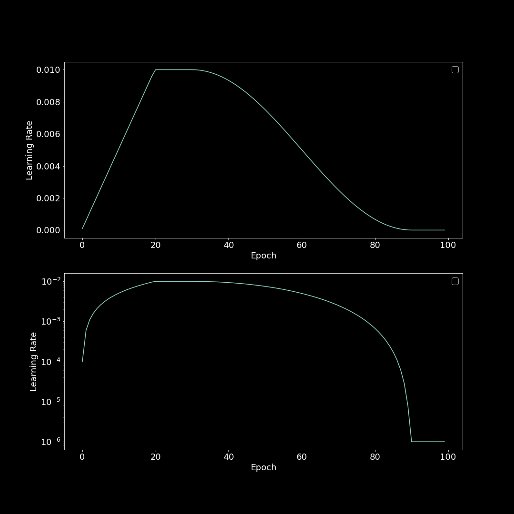

# Tensorflow CosineScheduleWithWarmup



- Tensorflow
  has [tf.keras.optimizers.schedules.CosineDecay](https://www.tensorflow.org/api_docs/python/tf/keras/optimizers/schedules/CosineDecay)
  , but doesn't have Warmup scheduler.
- This repository describes an example of cosine decay with warmup learning rate scheduler which can be used as Callback
  in ```model.fit()```.
- Additional parameters are available to control the steps to keep lr_max / lr_min.
- Please see the [example.ipnyb](/example.ipynb) for details.

### Usage

```python
def cosine_schedule_with_warmup(curr_epoch):
    global epochs
    lr_start = 1e-4
    lr_max = 1e-2
    lr_min = 1e-6
    num_warmup_steps = 20
    num_keep_lr_max_steps = 10
    num_keep_lr_min_steps = 10

    # linear warmup
    if curr_epoch < num_warmup_steps:
        lr = (lr_max - lr_min) / num_warmup_steps * curr_epoch + lr_start

    # keep lr_max
    elif num_warmup_steps <= curr_epoch < num_warmup_steps + num_keep_lr_max_steps:
        lr = lr_max

    # start cosine decay
    # after decay_steps, keep lr_min
    else:
        decay_steps = epochs - num_warmup_steps - num_keep_lr_max_steps - num_keep_lr_min_steps
        cosine_decay = tf.keras.optimizers.schedules.CosineDecay(initial_learning_rate=lr_max,
                                                                 decay_steps=decay_steps,
                                                                 alpha=lr_min / lr_max,
                                                                 )
        lr = cosine_decay(curr_epoch - num_warmup_steps - num_keep_lr_max_steps).numpy()

    return lr


epochs = 100
scheduler = tf.keras.callbacks.LearningRateScheduler(cosine_schedule_with_warmup,
                                                     verbose=1)

model.fit(x_train,
          y_train,
          epochs=epochs,
          callbacks=scheduler)
```